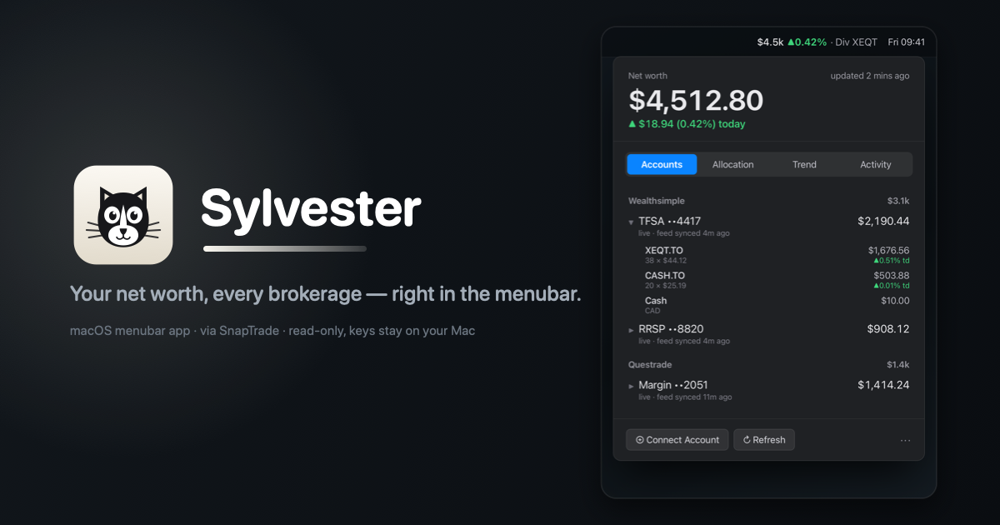

<p align="center">
  
</p>

<p align="center">
  
  
  
  
</p>

**SnapBar** is a macOS menubar app showing your net worth and per-account breakdown across every brokerage you've linked in [SnapTrade](https://snaptrade.com) — holdings, allocation, a net-worth trend, and an activity feed with native notifications for new dividends, trades, and deposits. It's a pure local client: tokens live in the macOS Keychain and data is pulled straight from the SnapTrade API.

## Install

**Homebrew** (recommended):

```sh
brew install --cask chang-07/tap/snapbar
```

Or grab the **`.dmg`** from [Releases](https://github.com/chang-07/snapbar/releases/latest) and drag **SnapBar** to **Applications**.

SnapBar is ad-hoc signed (not notarized), so clear the download quarantine once:

```sh
xattr -dr com.apple.quarantine /Applications/SnapBar.app
```

(or skip it with `HOMEBREW_CASK_OPTS="--no-quarantine" brew install --cask chang-07/tap/snapbar`). Then launch — the icon appears in your menubar. Requires macOS 14+ (Apple Silicon).

Build from source instead: `./install.sh`.

## Setup

Click the menubar item, then **Sign in with SnapTrade** — a browser opens to sign into your SnapTrade account and approve read access. Nothing to paste; tokens are stored in the **macOS Keychain**. Then **Connect Account** opens the SnapTrade portal to link your brokerages.

Prefer a partner API key? Expand **Advanced** in the wizard to paste a `clientId` + `consumerKey` (HMAC flow) instead.

## Config

Non-secret settings live at `~/.config/snapbar/config.json` (chmod 600):

- `baseCurrency` — net-worth display currency (default `USD`)
- `refreshMinutes` — auto-refresh cadence (default 15)
- `fxRates` — manual `{currency: baseCurrency-per-unit}` fallbacks, e.g. `{"CAD": 0.73}`; live rates come from frankfurter.dev
- `apiBaseURL` — API host override (default prod; set to point at staging)

## Notes

- **Read-only.** Personal sign-in uses SnapTrade's OAuth2 bearer flow (PKCE, `read` scope); partner keys use canonical-JSON HMAC-SHA256 signing. Neither can trade or move money.
- Balances come from SnapTrade's cached reads (no forced broker refreshes), so data moves at broker sync cadence — roughly daily. Rows flag anything staler than 36h.
- Notifications require the `.app` bundle (a bare `swift run` can't post them).

## Develop

```sh
./make-app.sh && open dist/SnapBar.app   # build + run the bundle
./install.sh                             # build + install to /Applications
./release.sh                             # build a distributable .dmg
```
